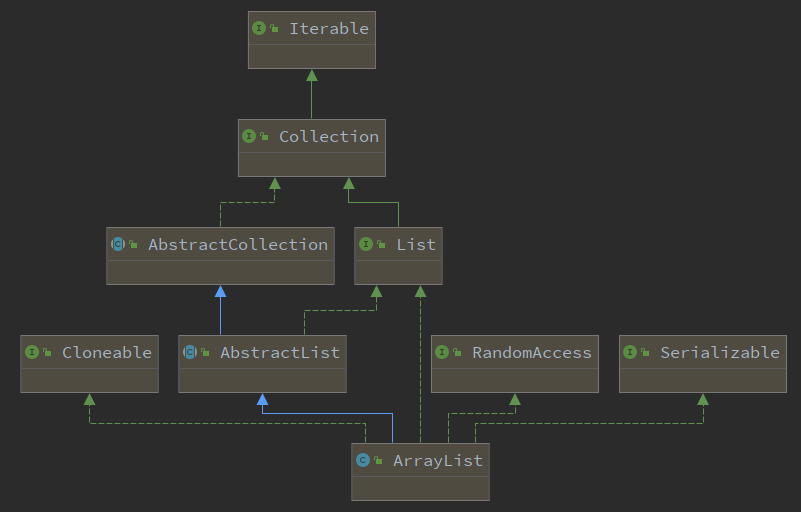

## 数组ArrayList

### 1.概述

ArrayList，基于数组**Object[]**实现的，是支持**自动扩容**的数组。

### 2.类图

ArrayList 实现的接口、继承的抽象类，如下图所示：

ArrayList实现了4个接口：

- [java.util.List](https://github.com/rongau3/jdk/blob/master/src/java.base/share/classes/java/util/List.java)：接口，定义了数组的基础操作
- [java.util.RandomAccess](https://github.com/rongau3/jdk/blob/master/src/java.base/share/classes/java/util/RandomAccess.java)：支持**快速随机**访问
- [java.io.Serializable](https://github.com/rongau3/jdk/blob/master/src/java.base/share/classes/java/io/Serializable.java)：支持序列化
- [java.lang.Cloneable](https://github.com/rongau3/jdk/blob/master/src/java.base/share/classes/java/lang/Cloneable.java)：支持克隆

ArrayList继承 [java.util.AbstractList](https://github.com/rongau3/jdk/blob/master/src/java.base/share/classes/java/util/AbstractList.java) 抽象类，而 AbstractList 提供了 List 接口的骨架实现，大幅度的减少了实现**迭代遍历**相关操作的代码。

### 3.属性